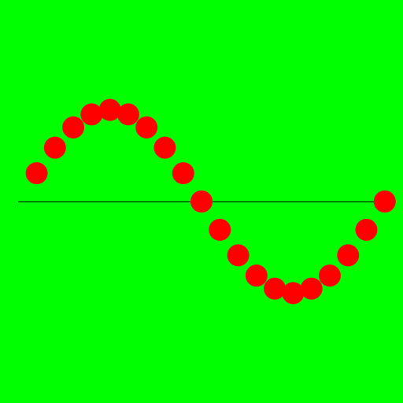
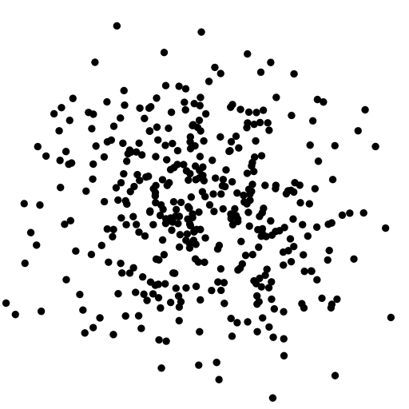

.. _graphics:

########
Graphics
########

One reason for the use of Java is the graphics libraries that allow you to make a (reasonably platform-independent) GUI.  This can be fairly tedious to do using the basic routines.  But since we have the ``StdDraw`` library (see :ref:`libraries`), we can make a simple example easily:

.. sourcecode:: java

    import java.util.Arrays;

    public class Test {
        public static void main(String[] args) {
            StdDraw.setXscale(0,200);
            StdDraw.setYscale(0,200);
            StdDraw.clear(StdDraw.GREEN);
            double x,y,r;
            int N = 20;
            double[] xlist = new double[N];
            double[] ylist = new double[xlist.length];
            // xlist = [0,0.1 .. 0.9]
            for (int i = 0; i < N; i++) {
                xlist[i] = (i+1)/10.0;
            }
            for (int i = 0; i < xlist.length; i++) {
                x = xlist[i];
                y = Math.sin(x * Math.PI);
                ylist[i] = y;
            }

            StdDraw.setPenColor(StdDraw.BLACK);
            StdDraw.line(0,100,200,100);

            StdDraw.setPenColor(StdDraw.RED);
            r = 6;
            for (int i = 0; i < xlist.length; i++) {
                x = xlist[i];
                y = ylist[i];
                StdDraw.filledCircle(100*x,50*y+100,r);
            }

            StdDraw.show(0);
            StdDraw.save("example.png");
            //System.exit(0);
        }
    }
    
If you run this in the usual way, it will show the graphic in a window and also save it to a file on the Desktop.  You will have to close the window manually.  If you'd rather not, un-comment the last line ``System.exit(0);``

The image looks like this:

Here is a second example that also uses ``StdDraw`` and in addition uses ``StdRandom``

.. sourcecode:: java

    public class Test {
        public static void main(String[] args) {
            double x,y;
            int N = Integer.parseInt(args[0]);
            for (int i = 0; i < N; i++) {
                x = StdRandom.gaussian(0.5,0.2);
                y = StdRandom.gaussian(0.5,0.2);
                StdDraw.filledCircle(x,y,0.01);
            }
            StdDraw.save("gaussian.png");
            System.exit(0);
        }
    }
    
.. sourcecode:: bash

    > javac Test.java
    > java Test 250
    >

